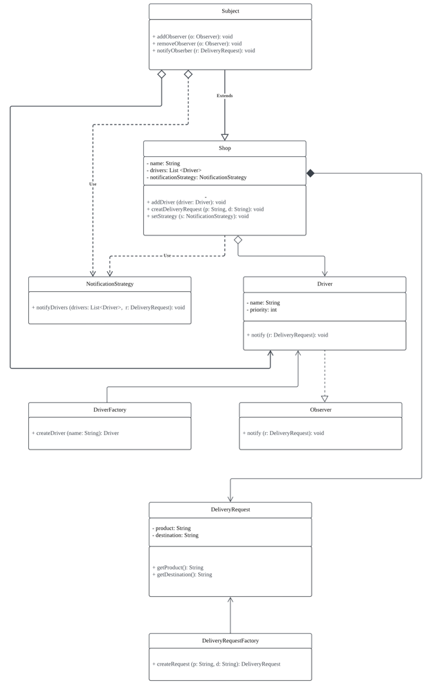

| CS-665       | Software Design & Patterns   |
|--------------|------------------------------|
| Name         | Qiong Wang                   |
| Date         | 12/08/2024                   |
| Course       | Fall                         |
| Assignment # | Hw6 Refactor Delivery System |

# Assignment Overview
This project is part of CS-665: Software Designs and Patterns. The goal is to improve a previous project assignment by refactoring and applying design patterns to enhance the functionality and flexibility of the system. This assignment focuses on refactoring a previous solution by identifying and addressing at least 3 areas for improvement, applying design patterns, and implementing unit tests.

### Key Requirements:
1. Identify and address at least 3 areas for code improvement in one of your past assignments ( I choice to refactor my assignment #2).
2. Apply design patterns to solve identified issues and improve the code.
3. Create a UML class diagram that illustrates the design patterns used.
4. Implement unit tests to demonstrate the functionality of the refactored solution.

---

### Design Pattern Improvements:

The following design patterns were introduced to improve the system's flexibility, decoupling, and extendibility:

#### **1. Observer Pattern**
- **Current Problem**: The `Shop` class directly depends on the `Driver` class to implement the notification logic, leading to tight coupling between these classes.
- **Improvement**: By introducing the **Observer Pattern**, the `Driver` class acts as an **Observer**, and the `Shop` class acts as the **Subject**. This decouples the `Shop` and `Driver` classes, allowing for more flexible and scalable changes in the future.

**Implementation**:
1. An `Observer` interface was created, which defines the `notify()` method.
2. The `Driver` class implements the `Observer` interface to receive notifications.
3. The `Shop` class was modified to manage a list of observers and notify them whenever a new delivery request is created.

#### **2. Factory Method Pattern**
- **Current Problem**: Object creation for `Driver` and `DeliveryRequest` was directly done using `new` statements, which led to tight coupling and limited flexibility.
- **Improvement**: The **Factory Method Pattern** was applied to encapsulate the object creation logic for `Driver` and `DeliveryRequest`, reducing the need for hardcoding and improving extensibility.

**Implementation**:
1. A `DriverFactory` was introduced to create `Driver` objects dynamically.
    - Example: `DriverFactory.createDriver(String name)`
2. A `DeliveryRequestFactory` was introduced to create `DeliveryRequest` objects based on product and destination.
    - Example: `DeliveryRequestFactory.createRequest(String product, String destination)`

#### **3. Strategy Pattern**
- **Current Problem**: The notification method for informing drivers in the `Shop` class was fixed and could not be changed dynamically (e.g., to prioritize certain drivers).
- **Improvement**: The **Strategy Pattern** was implemented to allow dynamic selection of different notification strategies, such as broadcasting to all drivers or notifying priority drivers.

**Implementation**:
1. A `NotificationStrategy` interface was created with a method `notifyDrivers(List<Driver>, DeliveryRequest)`.
2. Two concrete strategy classes were introduced:
    - `BroadcastNotificationStrategy`: Notifies all drivers.
    - `PriorityNotificationStrategy`: Notifies the highest priority drivers (e.g., nearest drivers).
3. The `Shop` class was updated to have a `NotificationStrategy` field, allowing dynamic setting of the notification strategy.

---

# GitHub Repository Link:
(https://github.com/QiongWang1/CS665_Hw6)

# Implementation Description

This project implements a notification system for retailers to communicate delivery requests to freelance drivers using **Observer Pattern**, **Factory Method Pattern**, and **Strategy Pattern**. The system consists of three main components: `Shop`, `Driver`, and `DeliveryRequest`, which interact to broadcast delivery notifications when a new request is created.

### Key Components:
1. **Shop**: The `Shop` class represents a store that can generate delivery requests. It maintains a list of registered drivers (observers) and notifies them whenever a new delivery request is created.
    - **Methods**:
        - `addDriver(Driver driver)`: Registers a driver to the shop.
        - `createDeliveryRequest(String product, String destination)`: Generates a delivery request and notifies all registered drivers using the selected notification strategy.
        - `notifyDrivers(DeliveryRequest request)`: Sends the delivery request to all drivers using the current strategy.

2. **Driver**: The `Driver` class represents a freelance driver who can receive notifications from shops about new delivery requests.
    - **Methods**:
        - `notify(DeliveryRequest request)`: Receives a notification of a delivery request, including details such as the product and destination.

3. **DeliveryRequest**: This class encapsulates the details of a delivery request, including the product to be delivered and the destination.

---

### System Flow:
1. The `Shop` registers multiple `Driver` objects as observers.
2. When the `Shop` creates a new `DeliveryRequest`, it notifies all registered `Driver` objects using the current `NotificationStrategy`.
3. Each `Driver` processes the delivery request by printing the details of the request.

---

### Unit Tests:
The functionality of the system is verified using JUnit tests:
- **testAddDriver()**: Verifies that drivers are successfully added to the shop.
- **testCreateDeliveryRequest()**: Ensures that all drivers receive the delivery request notification.
- **testNoDriversRegistered()**: Confirms that no notifications are sent if no drivers are registered.

---

### Design Patterns Used
This project leverages the following design patterns:
1. **Observer Pattern**: Manages notifications from the `Shop` (Publisher) to `Driver` (Observer).
2. **Factory Method Pattern**: Used to encapsulate object creation for `Driver` and `DeliveryRequest`.
3. **Strategy Pattern**: Allows dynamic switching of notification strategies in the `Shop` class.

---

# UML Class Diagram
(https://lucid.app/lucidchart/ff1530bd-8b66-4334-bd41-5f8f1e9c1279/edit?viewport_loc=-1592%2C-544%2C5352%2C2740%2C0_0&invitationId=inv_2e9049d2-dc1a-42d2-b3f5-f3628c9c2041)


---

# Running JUnit Tests

To verify the functionality of the system, JUnit tests have been implemented to test the core components of the project. These tests ensure that the system behaves as expected under various conditions.

### Steps to Run the JUnit Tests:
1. **Compile the Project**:
   Ensure the project is compiled by running the following Maven command:
   ```bash
   mvn clean compile

```bash
   mvn test